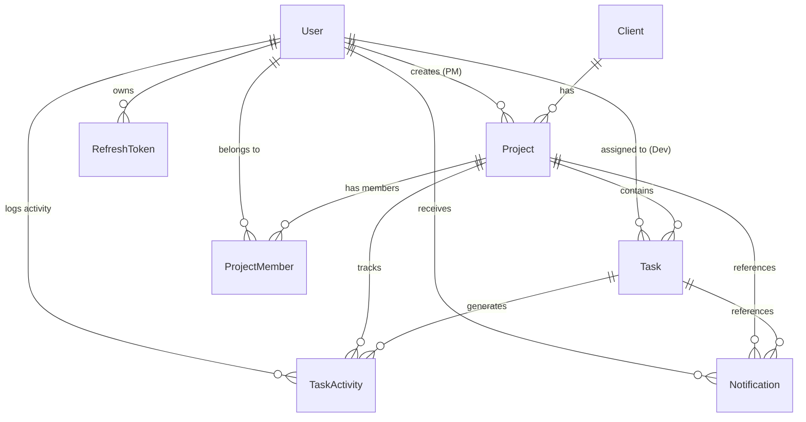

# Velozity — Real-Time Client Project Dashboard

> A production-grade agency management dashboard with strict role-based access control (RBAC), database-backed activity history, role-filtered real-time WebSocket feeds, missed event catch-up on reconnection, live online presence, real-time notifications, and automated background overdue processing.

---

## Table of Contents

1. [Project Overview](#project-overview)
2. [Core Features](#core-features)
3. [Technology Stack](#technology-stack)
4. [Architecture & Folder Structure](#architecture--folder-structure)
5. [Database Schema & Relationships](#database-schema--relationships)
6. [Database Indexes & Performance Strategy](#database-indexes--performance-strategy)
7. [Authentication Architecture](#authentication-architecture)
   - [Access Token Strategy](#access-token-strategy)
   - [Refresh Token Strategy & Rotation](#refresh-token-strategy--rotation)
   - [Why HttpOnly Cookie for Refresh Tokens](#why-httponly-cookie-for-refresh-tokens)
8. [Strict Role-Based Access Control (RBAC)](#strict-role-based-access-control-rbac)
   - [Permission Matrix](#permission-matrix)
   - [Resource Ownership Enforcement](#resource-ownership-enforcement)
   - [IDOR Prevention](#idor-prevention)
9. [Real-Time WebSocket System (Socket.io)](#real-time-websocket-system-socketio)
   - [Why Socket.io over Native WebSockets](#why-socketio-over-native-websockets)
   - [Server-Side Room Authorization Strategy](#server-side-room-authorization-strategy)
   - [Real-Time Activity Feed & Role Filtering](#real-time-activity-feed--role-filtering)
   - [Missed Event Catch-Up Strategy (Database-Backed)](#missed-event-catch-up-strategy-database-backed)
   - [Online Presence Tracking with Multi-Socket Deduplication](#online-presence-tracking-with-multi-socket-deduplication)
10. [Notification System](#notification-system)
11. [Background Scheduler (Overdue Processing)](#background-scheduler-overdue-processing)
    - [Why node-cron over BullMQ](#why-node-cron-over-bullmq)
    - [Idempotent Overdue Logic](#idempotent-overdue-logic)
12. [API Reference](#api-reference)
13. [Validation & Error Handling Strategy](#validation--error-handling-strategy)
14. [Architectural Decision Records (ADRs)](#architectural-decision-records-adrs)
15. [Local Development Setup](#local-development-setup)
16. [Docker Setup](#docker-setup)
17. [Testing Strategy & Test Execution](#testing-strategy--test-execution)
18. [Production Deployment Architecture](#production-deployment-architecture)
19. [Known Limitations](#known-limitations)
20. [Assessment Explanation (150–250 Words)](#assessment-explanation)

---

## 1. Project Overview

Velozity is an internal digital agency product designed to manage clients, projects, tasks, developers, project managers, and live team operations. Unlike simple CRUD tutorial apps, Velozity enforces strict multi-tenant style isolation at the API and database query levels, pairs relational database transactions with WebSocket broadcast pipelines, provides database-persisted missed-event catch-up after socket disconnections, and executes background task status evaluations via scheduled cron workers.

---

## 2. Core Features

- **Strict API-Level RBAC**: Three roles (`ADMIN`, `PROJECT_MANAGER`, `DEVELOPER`) with resource-ownership guards enforced at the controller, service, and database query layers.
- **Secure Authentication**: Short-lived JWT access tokens held exclusively in memory; rotatable refresh tokens hashed with bcrypt in PostgreSQL and delivered exclusively over `HttpOnly`, `SameSite` cookies.
- **Transactional State & Activity Logging**: Every task state transition commits task updates, activity audit records, and recipient notifications inside a PostgreSQL transaction (`prisma.$transaction`) before broadcasting socket events.
- **Role-Filtered Real-Time Activity Feed**: Live Socket.io updates broadcast only to authorized rooms (`admin:global`, `project:{id}`, `developer:{userId}`). Server derives membership from authenticated socket tokens.
- **Database-Backed Catch-Up**: On reconnection, clients query PostgreSQL for the latest 20 activities strictly within their role authorization scope.
- **Real-Time Presence Tracking**: Real-time online user counters and active user rosters backed by multi-tab deduplicated in-memory socket maps.
- **Real-Time Notification Center**: Task assignments and `IN_REVIEW` handoffs persist notifications in the database and push instant badge updates over WebSockets.
- **Automated Overdue Task Worker**: Periodic background job (`node-cron`) identifies incomplete tasks past their deadline, marks `isOverdue: true`, creates activity records, and emits alert notifications idempotently.
- **URL-Persisted Server-Side Filtering**: Task queries support `status`, `priority`, `dueFrom`, `dueTo`, and `isOverdue` filters evaluated in SQL with pagination metadata.

---

## 3. Technology Stack

### Backend
- **Runtime**: Node.js (v20+)
- **Framework**: Express.js with TypeScript (strict mode)
- **Database**: PostgreSQL 16
- **ORM**: Prisma ORM 5.x
- **Real-time**: Socket.io 4.x
- **Background Jobs**: node-cron 3.x
- **Validation**: Zod 3.x
- **Security**: Helmet, CORS with credentials, express-rate-limit, bcryptjs, jsonwebtoken, cookie-parser
- **Testing**: Vitest + Supertest

### Frontend
- **Framework**: React 19 + TypeScript
- **Bundler**: Vite 6.x
- **State Management**: Zustand (Auth, Socket & UI state) + TanStack React Query v5 (Server cache & mutations)
- **Routing**: React Router DOM v7
- **Styling**: Tailwind CSS + Lucide Icons + clsx + tailwind-merge
- **Date Handling**: date-fns (relative time derived from timestamps)

---

## 4. Architecture & Folder Structure

```
SARATH_VELOZITY GLOBAL SOLUTIONS/
├── docker-compose.yml             # PostgreSQL 16 container configuration
├── backend/
│   ├── src/
│   │   ├── config/                # Environment validation (Zod) & Prisma client singleton
│   │   │   ├── database.ts
│   │   │   └── env.ts
│   │   ├── controllers/           # Thin HTTP request handlers
│   │   │   ├── auth.controller.ts
│   │   │   ├── client.controller.ts
│   │   │   ├── notification.controller.ts
│   │   │   ├── project.controller.ts
│   │   │   ├── task.controller.ts
│   │   │   └── user.controller.ts
│   │   ├── jobs/                  # Background jobs (node-cron overdue scanner)
│   │   │   └── overdueTask.job.ts
│   │   ├── middleware/            # JWT authentication, RBAC, Zod validation & Error handling
│   │   │   ├── authenticate.ts
│   │   │   ├── authorize.ts
│   │   │   ├── errorHandler.ts
│   │   │   └── validate.ts
│   │   ├── repositories/          # Prisma database access layer
│   │   │   ├── activity.repository.ts
│   │   │   ├── refreshToken.repository.ts
│   │   │   └── user.repository.ts
│   │   ├── routes/                # Express router definitions
│   │   │   ├── activity.routes.ts
│   │   │   ├── auth.routes.ts
│   │   │   ├── client.routes.ts
│   │   │   ├── notification.routes.ts
│   │   │   ├── project.routes.ts
│   │   │   ├── task.routes.ts
│   │   │   └── user.routes.ts
│   │   ├── services/              # Business logic & transactional boundaries
│   │   │   ├── auth.service.ts
│   │   │   ├── client.service.ts
│   │   │   ├── notification.service.ts
│   │   │   ├── project.service.ts
│   │   │   ├── task.service.ts
│   │   │   └── user.service.ts
│   │   ├── types/                 # Shared TypeScript interfaces & Socket event maps
│   │   │   ├── express.d.ts
│   │   │   └── index.ts
│   │   ├── utils/                 # Cryptography, JWT, structured response helpers
│   │   │   ├── crypto.ts
│   │   │   ├── jwt.ts
│   │   │   └── response.ts
│   │   ├── validators/            # Zod validation schemas for all requests
│   │   │   └── index.ts
│   │   ├── websocket/             # Socket.io server, presence maps, and authorized room joins
│   │   │   └── socketServer.ts
│   │   ├── app.ts                 # Express application setup
│   │   └── server.ts              # Server bootstrap, HTTP listener & graceful shutdown
│   ├── prisma/
│   │   ├── schema.prisma          # PostgreSQL relational schema, enums & composite indexes
│   │   └── seed.ts                # Realistic seed script (Admins, PMs, Devs, Projects, Tasks, Logs)
│   ├── tests/                     # Integration tests (Auth, RBAC, Tasks, Overdue cron)
│   │   ├── auth.test.ts
│   │   ├── rbac.test.ts
│   │   ├── task.test.ts
│   │   ├── overdueJob.test.ts
│   │   └── setup.ts
│   ├── .env.example
│   ├── package.json
│   ├── tsconfig.json
│   └── vitest.config.ts
├── frontend/
│   ├── src/
│   │   ├── api/                   # Axios client with auto-refresh interceptors & API services
│   │   │   ├── client.ts
│   │   │   └── index.ts
│   │   ├── components/
│   │   │   ├── activity/          # Live real-time activity feed
│   │   │   ├── notifications/     # Bell icon, unread counter & dropdown
│   │   │   └── ui/                # Status badges, priority badges, loading spinners, empty states
│   │   ├── hooks/                 # Socket.io lifecycle hook & Silent auth refresh hook
│   │   │   ├── useAuthInit.ts
│   │   │   └── useSocket.ts
│   │   ├── layouts/               # Responsive sidebar, navigation & top header with presence
│   │   │   ├── AppLayout.tsx
│   │   │   └── Sidebar.tsx
│   │   ├── pages/
│   │   │   ├── admin/             # User and Client management screens
│   │   │   ├── DashboardPage.tsx  # Role-tailored dashboards (Admin, PM, Developer)
│   │   │   ├── LoginPage.tsx      # Sign-in screen with quick-fill credentials
│   │   │   ├── ProjectDetailPage.tsx
│   │   │   ├── ProjectsPage.tsx
│   │   │   └── TasksPage.tsx      # URL-filtered task list with pagination
│   │   ├── routes/                # ProtectedRoute wrapper
│   │   ├── store/                 # Zustand memory stores (Auth & Socket)
│   │   │   ├── authStore.ts
│   │   │   └── socketStore.ts
│   │   ├── types/                 # Frontend TypeScript interfaces mirroring backend
│   │   │   └── index.ts
│   │   ├── utils/                 # Relative time formatting, status color mappings
│   │   ├── App.tsx
│   │   ├── index.css
│   │   └── main.tsx
│   ├── .env.example
│   ├── package.json
│   ├── tailwind.config.js
│   ├── tsconfig.json
│   └── vite.config.ts
```

---

## 5. Database Schema & Relationships

The database is built on PostgreSQL using Prisma.



### Models Summary

1. **`User`**: `id` (UUID), `name`, `email` (unique), `passwordHash`, `role` (`ADMIN` | `PROJECT_MANAGER` | `DEVELOPER`), `createdAt`, `updatedAt`.
2. **`Client`**: `id`, `name`, `email`, `phone`, `company`, `notes`, `createdAt`, `updatedAt`.
3. **`Project`**: `id`, `name`, `description`, `clientId` (FK), `createdById` (FK to User — authoritative PM owner), `createdAt`, `updatedAt`.
4. **`ProjectMember`**: `id`, `projectId` (FK), `userId` (FK), `createdAt`. Composite unique index on `[projectId, userId]`.
5. **`Task`**: `id`, `projectId` (FK), `title`, `description`, `assignedDeveloperId` (FK nullable), `status` (`TODO` | `IN_PROGRESS` | `IN_REVIEW` | `DONE`), `priority` (`LOW` | `MEDIUM` | `HIGH` | `CRITICAL`), `dueDate`, `isOverdue` (Boolean flag), `overdueNotifiedAt`, `createdAt`, `updatedAt`.
6. **`TaskActivity`**: `id`, `taskId` (FK), `projectId` (denormalized FK for O(1) project queries), `userId` (FK), `oldStatus`, `newStatus`, `action`, `metadata` (JSON), `createdAt`.
7. **`Notification`**: `id`, `recipientId` (FK), `type` (`TASK_ASSIGNED` | `TASK_IN_REVIEW` | `TASK_OVERDUE` | `PROJECT_CREATED`), `message`, `relatedTaskId` (FK), `relatedProjectId` (FK), `isRead` (Boolean), `readAt`, `createdAt`.
8. **`RefreshToken`**: `id`, `userId` (FK), `tokenHash` (unique bcrypt hash), `expiresAt`, `revokedAt`, `createdAt`.

---

## 6. Database Indexes & Performance Strategy

Indexes have been deliberately designed for high-frequency access paths and scheduler operations:

| Table | Index Columns | Query Optimization Target |
|---|---|---|
| `users` | `[email]`, `[role]` | Login lookups & role-filtered user listings |
| `projects` | `[createdById]`, `[clientId]` | PM ownership queries & Client cascade restrictions |
| `project_members` | `[projectId, userId]`, `[userId]` | Membership verification & team tracking |
| `tasks` | `[projectId, status]` | Project task lists partitioned by workflow state |
| `tasks` | `[assignedDeveloperId, status]` | Developer dashboard & assigned task retrieval |
| `tasks` | `[dueDate, status]` | Background cron job: `dueDate < NOW() AND status != 'DONE'` |
| `tasks` | `[isOverdue, status]` | Real-time dashboard overdue count aggregation |
| `tasks` | `[projectId, priority]` | Priority-sorted task lists |
| `task_activities` | `[projectId, createdAt]` | PM activity feed (activities in owned projects) |
| `task_activities` | `[taskId, createdAt]` | Developer activity feed (activities on assigned tasks) |
| `task_activities` | `[createdAt]` | Admin global activity feed |
| `notifications` | `[recipientId, isRead]` | Fast unread badge counter (`WHERE recipientId = ? AND isRead = false`) |
| `notifications` | `[recipientId, createdAt]` | Paginated notification dropdown sorted by time |
| `refresh_tokens` | `[tokenHash]`, `[userId]` | Fast token lookup & user token revocation |

---

## 7. Authentication Architecture

### Access Token Strategy
- **Format**: Signed JSON Web Token (JWT).
- **Payload**: `{ userId, role, email }`.
- **Lifetime**: 15 minutes (`JWT_ACCESS_EXPIRES_IN=15m`).
- **Storage**: In-memory inside Zustand state. **Never stored in `localStorage` or `sessionStorage`**.
- **Transport**: `Authorization: Bearer <accessToken>` header on every API and Socket.io request.

### Refresh Token Strategy & Rotation
- **Format**: Cryptographically random UUID (`uuidv4()`).
- **Database Storage**: The raw token is hashed using `bcrypt` (cost 10) before inserting into the `refresh_tokens` table. The raw token never touches the database.
- **Cookie Security**: Delivered via an `HttpOnly`, `SameSite=Strict` (or `Lax` in dev), `Secure` (production) cookie on path `/auth`.
- **Token Rotation**: Every call to `POST /auth/refresh` revokes the existing refresh token and issues a brand-new refresh token + access token pair.
- **Reuse Detection**: If a revoked token is presented, all active sessions for that user are immediately invalidated.

---

## 8. Strict Role-Based Access Control (RBAC)

### Permission Matrix

| Feature / Action | ADMIN | PROJECT_MANAGER | DEVELOPER |
|---|---|---|---|
| View Global Dashboard & All Metrics | Yes | No (Own metrics only) | No (Assigned tasks only) |
| Manage Users (CRUD) | Yes | No (403 Forbidden) | No (403 Forbidden) |
| Manage Clients (CRUD) | Yes | Read-Only (for project creation) | No |
| Create Projects | Yes | Yes (owns created project) | No (403 Forbidden) |
| View / Edit Projects | All projects | Own created projects only | Projects with assigned tasks |
| Delete Projects | Yes | Own created projects only | No (403 Forbidden) |
| Create Tasks | Yes | Within owned projects | No (403 Forbidden) |
| Edit Task Details (Title/Assignee/Due Date) | Yes | Within owned projects | No (403/400 Validation) |
| Update Task Status | Yes | Within owned projects | Assigned tasks only |
| Activity Feed Scope | Global (all activity) | Projects created by PM | Tasks assigned to developer |
| View Online Presence List | Yes | No | No |

### Resource Ownership Enforcement (IDOR Prevention)
Authorization is enforced in the **database query itself**:
- When a developer requests `/tasks/123`, the service verifies `assignedDeveloperId === currentUser.id`. If not, it returns `404 Not Found` to prevent resource enumeration.
- When a PM requests `/projects/456`, the service verifies `createdById === currentUser.id`. If unauthorized, it returns `403 Forbidden`.
- Client-supplied IDs, roles, or ownership claims in request bodies/params are ignored in favor of the authenticated JWT context.

---

## 9. Real-Time WebSocket System (Socket.io)

### Room Strategy & Server-Side Join Authorization

Sockets connect with the access token in `socket.handshake.auth.token`. The server verifies the token, resolves the user in PostgreSQL, and assigns rooms on the server side:

```
Socket Connected (Authenticated)
  ├── All authenticated users ────────► join "user:{userId}"
  │
  ├── ADMIN ──────────────────────────► join "admin:global"
  │
  ├── PROJECT_MANAGER ────────────────► join "project:{projectId}" (only for projects where createdById = user.id)
  │
  └── DEVELOPER ──────────────────────► join "developer:{userId}"
```

**Security Guard**: Clients cannot request to join arbitrary project rooms. Room subscriptions are determined and managed purely by backend database queries during connection.

### Real-Time Activity Feed Pipeline

```
Client updates Task Status (PATCH /tasks/:id)
  │
  ├── 1. Verify Authentication & Role
  ├── 2. Begin PostgreSQL Transaction (prisma.$transaction)
  │      ├── Update Task status
  │      ├── Insert TaskActivity record
  │      └── (If IN_REVIEW) Create PM Notification
  ├── 3. Commit Transaction
  │
  └── 4. Emit Socket Event AFTER Commit
         ├── io.to("project:{projectId}").emit("task:statusChanged", payload)
         └── io.to("admin:global").emit("task:statusChanged", payload)
```

### Missed Event Catch-Up Strategy (Database-Backed)

When a client reconnects after being offline:
1. Socket connects and authenticates.
2. The server queries PostgreSQL directly (`task_activities` table) for the **latest 20 records** within that user's authorized scope.
3. Emits `activity:catchup` with the database records.
4. The frontend merges catch-up events with the live feed, deduplicating via `activityId` to prevent duplicate renders.

### Online Presence Tracking
- A global `Map<string, Set<string>>` maps `userId` to active `socketId` instances.
- Multiple browser tabs for the same user only increment the presence count once.
- Disconnecting a single tab removes that socket; the user is marked offline only when their socket set is empty.
- Presence updates are broadcast via `presence:updated`.

---

## 10. Notification System

1. **Task Assigned**: When a task is assigned or reassigned to a developer, a `TASK_ASSIGNED` notification is inserted in PostgreSQL and emitted over `user:{developerId}`.
2. **Task In Review**: When a developer moves a task to `IN_REVIEW`, a `TASK_IN_REVIEW` notification is inserted in PostgreSQL for the project's PM and emitted over `user:{pmId}`.
3. **Task Overdue**: Flagged by the background worker, generating notifications for both the developer and PM.
4. **Badge Synchronization**: `notification:countUpdated` pushes the exact unread count to the bell icon in real time.

---

## 11. Background Scheduler (Overdue Processing)

### Idempotent Overdue Logic (`node-cron`)

The background job runs every 15 minutes (`*/15 * * * *`):
1. Queries tasks where `dueDate < NOW() AND status != 'DONE' AND isOverdue = false`.
2. Inside a database transaction:
   - Sets `isOverdue: true` and `overdueNotifiedAt = NOW()`.
   - Inserts a `TaskActivity` record with action `OVERDUE_FLAGGED`.
   - Creates `TASK_OVERDUE` notifications for the developer and project PM.
3. Emits real-time notifications via WebSocket after transaction commit.
4. **Idempotency**: By filtering on `isOverdue = false`, subsequent runs skip already-flagged tasks, preventing duplicate logs or notifications.

---

## 12. API Reference

### Authentication
- `POST /auth/login` — Authenticate with email & password. Sets HttpOnly refresh cookie.
- `POST /auth/refresh` — Exchange HttpOnly cookie for a new access token (with token rotation).
- `POST /auth/logout` — Revoke refresh token and clear cookie.
- `GET /auth/me` — Return current authenticated user profile (`Bearer` token required).

### Users (Admin Only)
- `GET /users` — List all users (supports `?role=DEVELOPER`).
- `GET /users/:id` — Get user details.
- `POST /users` — Create a new user.
- `PATCH /users/:id` — Update user details or role.
- `DELETE /users/:id` — Delete user.

### Clients (Admin Write, All Read)
- `GET /clients` — List all clients with project counts.
- `GET /clients/:id` — Get client details with associated projects.
- `POST /clients` — Create a new client (Admin only).
- `PATCH /clients/:id` — Update client (Admin only).
- `DELETE /clients/:id` — Delete client (Admin only; blocked if projects exist).

### Projects (Role Enforced)
- `GET /projects` — List projects within user scope (Admin: all, PM: owned, Dev: with assigned tasks).
- `GET /projects/:id` — Get project details, task list, and client info.
- `POST /projects` — Create project (Admin, PM).
- `PATCH /projects/:id` — Update project (Admin, owning PM).
- `DELETE /projects/:id` — Delete project (Admin, owning PM).
- `GET /projects/:id/activity` — Get paginated activity for project (Admin, owning PM).
- `GET /projects/dashboard` — Get aggregated dashboard metrics tailored to role.

### Tasks (Role Enforced)
- `GET /tasks` — List tasks with server-side filters (`status`, `priority`, `dueFrom`, `dueTo`, `isOverdue`, `page`, `limit`).
- `GET /tasks/:id` — Get task details and activity history.
- `POST /projects/:projectId/tasks` — Create task within project (Admin, owning PM).
- `PATCH /tasks/:id` — Update task (Admin/PM: all fields; Dev: status only on assigned task).
- `DELETE /tasks/:id` — Delete task (Admin, owning PM).

### Notifications
- `GET /notifications` — Get paginated notifications for current user.
- `GET /notifications/unread-count` — Get current unread notification count.
- `PATCH /notifications/:id/read` — Mark single notification as read.
- `PATCH /notifications/read-all` — Mark all notifications as read for current user.

### Activity
- `GET /activity` — Get latest activity records within user's authorization scope.

---

## 13. Validation & Error Handling Strategy

- **Input Validation**: Handled by `validate(schema, target)` middleware using Zod. Coerces datetimes, checks UUID formats, enforces enums, and trims strings.
- **Consistent Response Format**:
  - Success: `{ success: true, data: T, meta?: Record<string, unknown> }`
  - Error: `{ success: false, error: { code: string, message: string, details?: unknown } }`
- **Error Obfuscation**: Centralized error middleware traps unhandled errors and Prisma exceptions, logging details server-side while emitting sanitized error codes (`CONFLICT`, `NOT_FOUND`, `INTERNAL_ERROR`) to clients.

---

## 14. Architectural Decision Records (ADRs)

### ADR 1: Express vs. Fastify
- **Decision**: Express.js with TypeScript.
- **Rationale**: Express provides battle-tested middleware interoperability (Helmet, CORS, Cookie-Parser, Rate-Limit) and seamless Socket.io integration without plugin wrapper complexity.

### ADR 2: Prisma ORM vs. Raw SQL
- **Decision**: Prisma ORM exclusively.
- **Rationale**: Provides end-to-end TypeScript type safety, automated migration management, relation eager loading, and transactional safety (`prisma.$transaction`) without leaking raw SQL strings into controllers.

### ADR 3: Socket.io vs. Native WebSockets
- **Decision**: Socket.io.
- **Rationale**: Socket.io offers built-in room management, automated reconnection fallbacks, handshake authentication middleware, and heartbeat ping/pong out of the box.

### ADR 4: node-cron vs. BullMQ
- **Decision**: node-cron.
- **Rationale**: For an agency dashboard without multi-worker horizontal scaling requirements, `node-cron` provides a zero-dependency, lightweight, reliable in-process scheduler without introducing a mandatory Redis dependency.

### ADR 5: Refresh Tokens in HttpOnly Cookies vs. LocalStorage
- **Decision**: HttpOnly, SameSite cookies for refresh tokens; in-memory Zustand store for access tokens.
- **Rationale**: Completely mitigates XSS-based token theft since JavaScript cannot read `HttpOnly` cookies.

### ADR 6: Database-Backed Activity Feed
- **Decision**: Persist every task transition in PostgreSQL `task_activities` before socket emission.
- **Rationale**: Sockets are transient. Storing activity in PostgreSQL guarantees an immutable audit trail and enables reliable catch-up queries on reconnect.

---

## 15. Local Development Setup

### Prerequisites
- Node.js v20+
- npm v10+
- PostgreSQL 16 (or Docker)

### Step 1: Clone Repository & Configure Environment
```bash
git clone <repository-url>
cd "SARATH_VELOZITY GLOBAL SOLUTIONS"

# Backend configuration
cd backend
cp .env.example .env

# Frontend configuration
cd ../frontend
cp .env.example .env
```

### Step 2: Install Dependencies
```bash
# In backend/
cd ../backend
npm install

# In frontend/
cd ../frontend
npm install
```

### Step 3: Initialize Database & Run Seed
```bash
cd ../backend

# Generate Prisma Client
npx prisma generate

# Apply migrations
npx prisma migrate dev --name init

# Seed database with sample data
npm run db:seed
```

### Step 4: Start Development Servers
```bash
# Terminal 1 — Backend (Port 4000)
cd backend
npm run dev

# Terminal 2 — Frontend (Port 5173)
cd frontend
npm run dev
```

Visit `http://localhost:5173` in your browser.

---

## 16. Docker Setup

To run PostgreSQL with Docker Compose:

```bash
# From repository root
docker compose up -d

# Verify container health
docker compose ps
```

---

## 17. Testing Strategy & Test Execution

The test suite covers Authentication, RBAC, Task Workflows, Overdue Processing, and IDOR Attack Scenarios.

```bash
cd backend
npm run test
```

### Test Coverage Highlights:
- **Auth**: Login with valid/invalid credentials, HttpOnly cookie validation, refresh token rotation, logout revocation, `/auth/me`.
- **RBAC**: Admin global access, PM project isolation (PM A blocked from PM B's project with 403), Developer task isolation (Dev A blocked from Dev B's task with 404), developer field restrictions.
- **Tasks**: Status update creates `TaskActivity`, moving to `IN_REVIEW` generates PM notification, task assignment generates developer notification, server-side filtering.
- **Overdue Job**: Past-due tasks marked `isOverdue: true`, activity logged, developer/PM notified, idempotent execution.

---

## 18. Production Deployment Architecture

- **Frontend**: Deployed to Vercel or Netlify as a static SPA.
- **Backend**: Deployed to a persistent Node.js environment (Railway, Render, Fly.io, or AWS ECS/EC2) to support long-lived WebSocket connections and cron schedules.
- **Database**: Managed PostgreSQL (Supabase, Neon, AWS RDS).
- **CORS & Cookies**: Configure `FRONTEND_URL` and `COOKIE_DOMAIN` on the backend to match the production frontend domain.

---

## 19. Known Limitations

- **Single-Node Presence**: Online presence is currently tracked in Node.js process memory. In a multi-node horizontal cluster, a Redis adapter for Socket.io (`@socket.io/redis-adapter`) would be used to share presence and room broadcasts across instances.
- **Job Concurrency**: `node-cron` runs within the single Node process. In a distributed multi-instance deployment, BullMQ with Redis locks would prevent duplicate cron executions.

---

## 20. Assessment Explanation

### Submission Summary (150–250 Words)

The primary technical challenge in building Velozity was implementing a real-time, role-filtered activity feed with guaranteed persistence and reconnect catch-up without compromising security.

To solve this, I designed a strict transactional architecture: every task status change is executed within a database transaction that updates the task, records an immutable `TaskActivity` row, and creates required notifications. Only after the transaction successfully commits to PostgreSQL does the server broadcast events through Socket.io. Crucially, room authorization is enforced purely server-side during socket authentication—clients are placed into scoped rooms (`admin:global`, `project:{id}`, `developer:{userId}`) derived from database queries rather than client requests. When an offline user reconnects, the server executes a role-scoped SQL query against PostgreSQL to return the latest 20 missed events, which the frontend merges and deduplicates by `activityId`. 

If I were to build this system for a larger distributed deployment, I would replace the in-process presence map and `node-cron` scheduler with Redis-backed Socket.io adapters and BullMQ workers to enable seamless horizontal scaling across multiple container instances.

---

## Seed Credentials

All accounts use password: `Password123!`

| Role | Name | Email |
|---|---|---|
| **Admin** | Alex Administrator | `admin@velozity.dev` |
| **Project Manager** | Priya Sharma | `priya@velozity.dev` |
| **Project Manager** | Marco Rossi | `marco@velozity.dev` |
| **Developer** | Ravi Kumar | `ravi@velozity.dev` |
| **Developer** | Aisha Patel | `aisha@velozity.dev` |
| **Developer** | Chen Wei | `chen@velozity.dev` |
| **Developer** | Sara Johansson | `sara@velozity.dev` |
